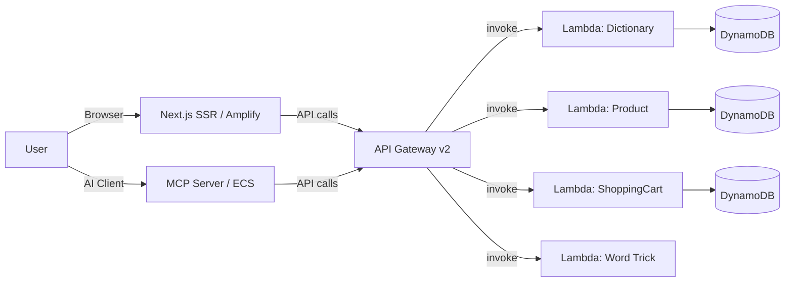

# Cool Python Project

Full-stack serverless application: Python Lambda API + Next.js frontend + MCP server, deployed to AWS.

## Architecture



## Quick Start (Full Stack Dev)

```bash
# Start everything: Floci → Terraform → MCP Server → Website
docker-compose up -d

# Website: http://localhost:3000
# MCP Server: http://localhost:8000/sse
```

The terraform-setup container auto-deploys local infrastructure (DynamoDB tables, Lambda functions, API Gateway) to Floci, a LocalStack-compatible AWS emulator.

## Project Structure

```
├── api/                          # Python Lambda backend
│   ├── dal/                      # DynamoDB Data Access Layer
│   ├── handlers/                 # Lambda entry points (4 handlers)
│   ├── utils/                    # Domain classes
│   └── tests/                    # Unit & integration tests
├── website/                      # Next.js 14 SSR frontend
│   ├── app/                      # App Router pages + API proxy
│   ├── components/               # Client components (shadcn/ui)
│   └── lib/                      # API client, utilities
├── mcp-server/                   # MCP server (FastMCP + Uvicorn)
├── infra/                        # Terraform infrastructure
│   ├── modules/crud/             # Reusable module (DynamoDB, Lambda, API GW, ECS, ALB)
│   ├── test/                     # Local dev environment (Floci)
│   ├── prod/                     # Production AWS environment
│   ├── Dockerfile.terraform      # Init container for local infra
│   └── docker-entrypoint-terraform.sh
├── .github/                      # CI/CD pipelines
│   ├── scripts/                  # Helper scripts (import-if-exists)
│   ├── workflows/ci.yml          # Tests, Terraform, SonarQube, Trivy
│   ├── workflows/cd.yml          # Deploy to AWS production
│   └── workflows/codeql.yml      # Security analysis
├── amplify.yml                   # Amplify build spec (appRoot: website)
├── docker-compose.yml            # Local dev stack
├── OBSERVABILITY.md              # CloudWatch monitoring inventory
├── opencode.json                 # OpenCode AI agent configuration
├── sonar-project.properties      # SonarQube project config
└── README.md
```

## Key Components

### API (`api/`)
Serverless Lambda functions handling CRUD operations for:
- **Dictionary** — Word definitions (`Word` partition key)
- **Product** — E-commerce products with UUIDs
- **Shopping Cart** — Carts storing full product snapshots
- **Word Trick** — String manipulation (stateless)

See [API README](api/README.md) for detailed documentation.

### Website (`website/`)
Next.js 14 App Router SSR application with shadcn/ui components:
- **Dictionary** — Add, list, and lookup word definitions
- **Shopping** — Browser products, manage cart with local state
- **Word Trick** — Apply word-trick algorithm

See [Website README](website/README.md) for frontend docs.

### MCP Server (`mcp-server/`)
Exposes all API operations as 21 MCP tools across 4 domains via SSE transport. Dual-mode product addition (snapshot or auto-fetch).

See [MCP Server README](mcp-server/README.md) for tool reference.

### Infrastructure (`infra/`)
Terraform-managed infrastructure with environment separation:
- **test/** — Local deployment via Floci (Docker-based AWS emulator)
- **prod/** — Real AWS deployment (DynamoDB, Lambda, API Gateway, ECS, Amplify)

See [Infrastructure README](infra/README.md) for deployment guide.

### CI/CD (`.github/workflows/`)
- **CI** — Python tests, TypeScript check, Terraform validate, Trivy scan, SonarQube, OpenAPI lint
- **CD** — Deploy infra to AWS on push to `main` with import-if-exists safety for persistent resources
- **CodeQL** — Weekly security analysis

See [Workflows README](.github/workflows/README.md) for details.

## Amplify Deployment

The frontend auto-deploys to AWS Amplify (WEB_COMPUTE SSR) on push.

- Build spec at `amplify.yml` with `appRoot: website`
- `baseDirectory: .next` — standard Next.js SSR output
- Production API URL set via Terraform env vars (`NEXT_PUBLIC_API_URL`)
- API Gateway CORS configured for Amplify origins

The Terraform-managed Amplify app is in `infra/prod/amplify.tf`.

## Dev Environment (Docker Compose)

```bash
docker-compose up -d
```

Starts 4 services:
1. **floci** — LocalStack-compatible AWS emulator (DynamoDB, Lambda)
2. **terraform-setup** — Init container that deploys infra to Floci
3. **mcp-server** — FastMCP server at `:8000/sse`
4. **website** — Next.js dev server at `:3000` (hot reload via volume mount)

Infra details: [Infrastructure README → Dev Workflow](infra/README.md#workflow)

## Testing

### Backend (Python)
```bash
python -m unittest discover -s api/tests -p "test_*.py" -v
```

### Frontend (TypeScript)
```bash
cd website && npx tsc --noEmit
cd website && npx vitest run
```

## Environment Variables

| Variable | Default | Scope | Description |
|----------|---------|-------|-------------|
| `STAGE` | `local` | Lambda | Deployment stage |
| `AWS_ENDPOINT_URL` | `http://localhost:4566` | Lambda | DynamoDB endpoint |
| `API_BASE_URL` | `http://floci:4566` | Proxy/Dev | Lambda invocation endpoint |
| `API_ID` | `""` | Proxy/Dev | API Gateway ID |
| `NEXT_PUBLIC_API_URL` | `/api/proxy` | Website | API endpoint for browser calls |

## License

MIT
